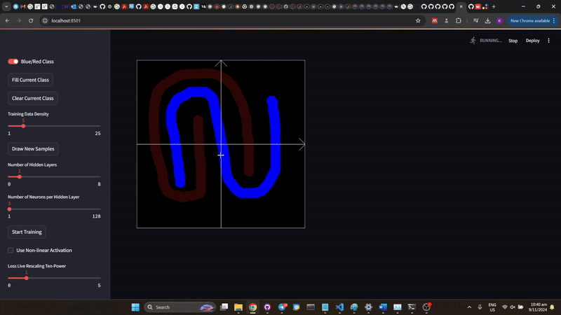

# mlviz

Customized Data + Sampling |  Under-parameterized Model | "Well"-parameterized Model 
:-------------------------:|:-------------------------:|:-------------------------:
 |  |   

Simple Web-UI to demonstrate core machine learning concepts such as:
1. Importance of non-linear activation functions
2. Effect of additional "neurons" for single layer perceptron
3. Expressiveness with more layers
4. Relationships between:
    * Task complexity 
    * Data availability
    * Data quality
    * Model complexity
5. Learning rate as a hyperparameter

If in use in a educational institute/workplace setting, please drop me an email at kianwei@u.nus.edu, so that I can be aware of any new features to support (and also because I'm curious as to who actually finds this useful! :grinning:).

## Installation

```
conda create -n mlviz python=3.12
cd mlviz
pip install -r requirements.txt
```

## To Run

```
streamlit run streamlit_app.py --server.headless true
```

## Demo

Apart from self-hosting/running locally by cloning this repository, you should be able to test the app hosted at [https://mlviz-kw.streamlit.app/](https://mlviz-kw.streamlit.app/) via Streamlit Community Cloud. 

## Todo

* Clean up code
* Add functionality to save and load sketches
* Add feature engineering function and demo (e.g. radial encoding)
* Reduce flickering when interacting with UI
